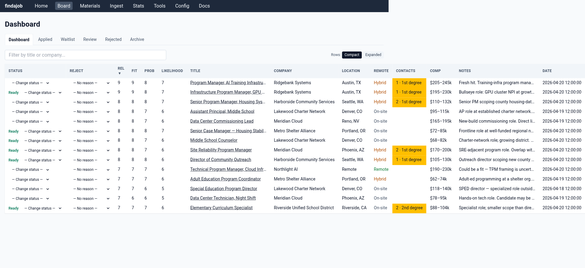
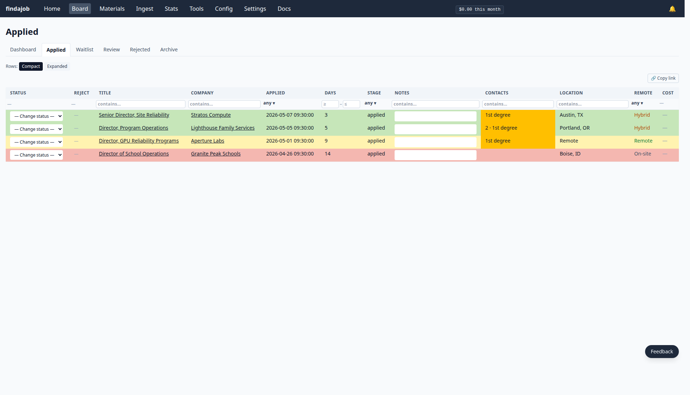
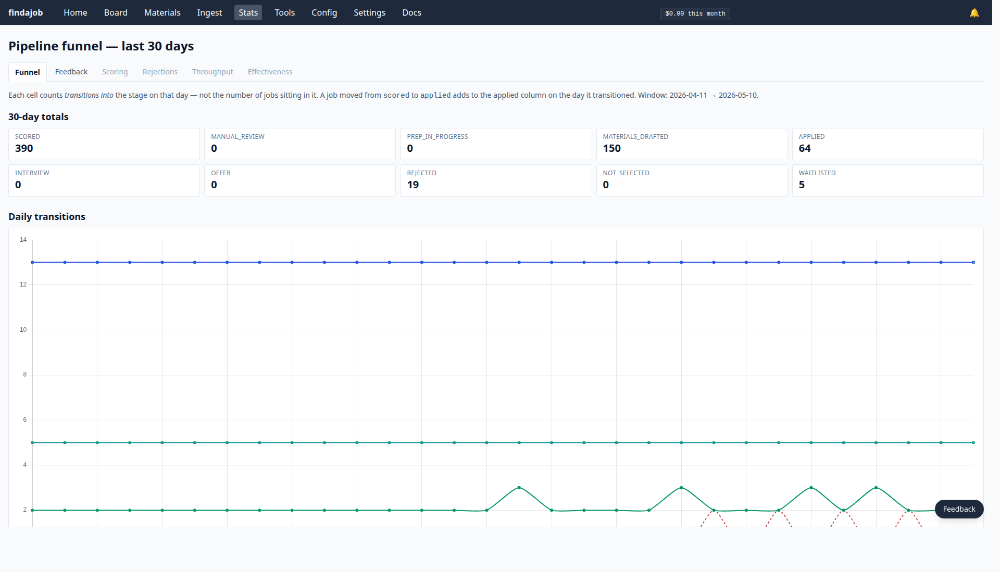

# findajob

**Self-hosted job search infrastructure: AI triages thousands of listings down to a handful, generates tailored materials for the ones worth applying to, and learns from every rejection.**

The modern job search grinds people down — hundreds of listings per day, most irrelevant; the same cover letter rewritten at midnight; black-hole rejections that tell you nothing about whether you targeted wrong, wrote wrong, or got unlucky. findajob absorbs the triage, the tailoring, and the tracking so your attention goes to the few applications actually worth sending.

Built and operated daily; pre-1.0 means active development.

---

## What it does

Despite the role labels you'll see in the architecture diagram below, you only need accounts at two services: **OpenRouter** (handles every AI call findajob makes) and **RapidAPI** (optional — for LinkedIn / Indeed search ingestion). Typical API spend is **~$20–50/mo** (LLM + optional RapidAPI), plus ~$5/mo for Fly.io hosting if you don't self-host. Plus a one-time ~$2–6 onboarding interview. Full breakdown: [`docs/getting-started/cost.md`](docs/getting-started/cost.md).

The pipeline narrows the funnel at every step where a human would otherwise waste attention — LLM triage on the way in, human triage on the way to prep, prep only for jobs worth applying to. Thirty days on the operator's instance:

```
Listings ingested                8,309   ── 30-day window
LLM-scored ≥7 (worth a look)       202      2.4%
Operator flagged for prep          105      52% of scored
Applications submitted              69      66% of flagged
Interviews from those 69 apps       12      17%
```

> Lifetime since the operator started using findajob (~45 days): 110 applications → **17 distinct jobs reached an interview stage** (8 still in interview now). Job-search interview rates are unpredictable; the system shrinks the application volume needed to get them.

8,309 listings narrowed to 69 applications in 30 days. Every rejection along the way is recorded with a reason — *Skills Mismatch*, *Too Senior*, *Comp Too Low*, *Geography/Onsite* — and those reasons feed back into tomorrow's scorer as negative examples. The system gets better at *your* search every week.

---

## How it works

**1. Daily triage** (00:00, scheduler-driven) — pulls 100–500 listings from LinkedIn (via RapidAPI), Indeed, direct ATS feeds (Greenhouse, Ashby, Lever, Workday), and your Gmail job alerts; cleans, deduplicates, enriches with job-description text; scores each against your candidate profile.

**2. Dashboard triage** — the web UI shows every scored job that cleared the threshold with relevance/fit/probability scores, known contacts from your LinkedIn export, and the LLM's notes on why it scored where it did. You flag the ones worth prepping.



*Fictional demo data spanning data-center ops, social services, and K-12 education — the same pipeline works for every field, only `profile.md` changes.*

**3. Prep** (one click) — generates a per-job folder containing a tailored resume, cover letter, deep-research company briefing, recruiter-perspective critique, and outreach drafts for known contacts. ~$1 of LLM spend per prep run, in 5–10 minutes (full breakdown in [`docs/getting-started/cost.md`](docs/getting-started/cost.md)).

**4. Apply and track** — submit the application, mark *Applied*. The Applied tab color-codes rows by days-since-submission so silent applications surface at a glance.



**5. Reject with reason** — jobs that don't pan out get rejected with a tagged reason. Those reasons are training examples for the next day's scorer. Manual-review flags point at the parts of your profile the LLM found ambiguous, so you know exactly where to tune.

**6. See the system working** — funnel and rejection-mix dashboards make the pipeline legible. Scorer drifting? Rejection reason spiking? You see it instead of guessing.



---

## How the prep pipeline works

The "one click → folder full of tailored materials" in step 3 is **seven sequential LLM stages**, each consuming the previous stages' output as explicit context:

```
   company_researcher  ─►  briefing_writer  ─►  fit_analyst
   (web research)          (writing)             (web research)
                                                      │
                                          fit spliced INTO briefing
                                          BEFORE Overall Recommendation
                                                      ▼
                                          merged briefing.md
                                                      │
                                                      ▼
                                          resume_tailor
                                          (writing)
                                                      │
                              ┌───────────────────────┴────────────────┐
                              ▼                                        ▼
                  resume_change_reviewer                    cover_letter_writer
                  (cheap diff vs master,                    (writing — consumes
                   no premium tokens                         briefing + tailored
                   spent on cheap work)                      resume)
                                                                       │
                                                                       ▼
                                                             recruiter_critic
                                                             (writing — sees ONLY
                                                              JD + resume + cover;
                                                              simulates a reader who
                                                              hasn't researched the
                                                              candidate)

   sidecar:  find_contacts  ─►  outreach_drafter (writing)
             reads LinkedIn connections.csv, drafts personalized notes
```

Three architectural choices make the outputs feel like they were written by someone who actually researched the company:

- **Explicit context chaining, not RAG.** Each stage's output is structured markdown that becomes literal input to the next stage. No vector embeddings, no similarity-retrieval guesses, no "the model couldn't find the relevant chunk." When prep produces a bad cover letter, you can read the briefing it was given and see why.
- **An asymmetric DAG, not a uniform pipeline.** `recruiter_critic` deliberately doesn't see the briefing or fit analysis — its job is to simulate a recruiter who hasn't researched the candidate, so giving it that context would defeat the purpose. The other writing stages share a `cached_prefix` (profile + master resume + JD) so the provider can cache and discount the repeated input across the run.
- **Per-role model judgment, not one model for everything.** A high-quality model where voice matters (briefing, resume, cover, critique, outreach). A web-grounded model where web grounding matters (`company_researcher`, `fit_analyst`). A cheap fast model for the diff review (`resume_change_reviewer`). A volume-tuned model for the high-frequency scorer that runs 100–500× a day. Specific model picks: [`docs/architecture.md`](docs/architecture.md).

Inline retry gates on Stages 2 and 3 catch malformed model output (missing `## Overall Recommendation`, empty fit analysis from the web-grounded model's intermittent `content=null`) before it propagates downstream.

Full DAG + per-stage I/O contracts + failure handling: [`docs/architecture.md`](docs/architecture.md).

---

## Why use it

- **Triage cuts the noise so you can focus.** 12K → 60 isn't unusual once the scorer learns your profile. Most job tools track what you applied to; this one finds the few worth applying to.
- **Your rejections train tomorrow's scoring.** Every *Skills Mismatch* / *Too Senior* / *Comp Too Low* tag is a labeled example. No other AI job tool closes that loop.
- **Tailored materials, locally generated.** Per-job folder with resume + cover letter + briefing + outreach drafts, sitting on your Docker host as plain `.docx` and `.md`. SQLite for state. The only outbound calls are to the LLM providers you've configured. No SaaS lock-in for your most personal data.
- **Field-agnostic.** Built by a data-center-ops candidate; works just as well for a social worker, teacher, accountant, or trades professional. Same pipeline, same setup — only `profile.md` changes. See [`docs/maintainers/generalization.md`](docs/maintainers/generalization.md).

---

## Stack

| Component | Choice |
|---|---|
| Triage scoring | volume-tuned LLM via OpenRouter |
| Materials writing | high-quality LLM via OpenRouter (prompt caching enabled) |
| Company research | web-grounded LLM via OpenRouter |
| Job sources | RapidAPI (LinkedIn, Indeed, Bing, JSearch), direct ATS feeds (Greenhouse, Ashby, Lever, Workday CXS), Gmail IMAP — opt-in per source at `/settings/active-sources/` |
| Storage | SQLite |
| Web UI | FastAPI + HTMX + Tailwind + Chart.js |
| Push notifications | [ntfy.sh](https://ntfy.sh) |
| Scheduler | supercronic (in-container) |

Specific model picks per stage: [`docs/architecture.md`](docs/architecture.md).

---

## Quick start

There are two ways to run findajob — pick based on whether you want to operate a Linux server:

- **Hosted on Fly.io** *(recommended for most people)* — runs on Fly's infrastructure under your account. ~$5/month for the always-on machine + 8 GB volume; you don't operate a server. Setup is `fly auth login` + a deploy script that prompts for your API keys, then ~60 minutes inside the app to complete the onboarding interview.
- **Self-hosted with Docker Compose** *(for operators)* — runs as `ghcr.io/brockamer/findajob` (`linux/amd64` + `linux/arm64`) on a server you operate. Zero hosting cost beyond what you already pay for the box. You handle backups, reverse proxy, TLS, and updates.

Both paths run the same image, complete the same onboarding interview, and reach the same dashboard. Full cost breakdown across paths and LLM cadences: [`docs/getting-started/cost.md`](docs/getting-started/cost.md).

### What you'll need

One required API key (both paths):

- **OpenRouter** — funds every LLM call (triage scoring, materials writing, in-app onboarding interview). Pay-as-you-go from $0; the one-time onboarding interview runs ~$2–6 in spend, then ~$0.50/day for triage-only and ~$1 per fully-prepped job (full breakdown: [`docs/getting-started/cost.md`](docs/getting-started/cost.md)). **Add at least $10 of credit to your OpenRouter wallet before you start the interview** — that covers the interview itself; **$20–$30 covers a typical first month of usage.** Pay-as-you-go funding: you add a balance, the system draws from it.

One optional API key (both paths):

- **RapidAPI (jobs-api14 or JSearch)** — LinkedIn / Indeed search ingestion. BASIC plans are free with no credit card: 150 req/month on jobs-api14, 200 req/month on JSearch. The onboarding picker chooses one per stack (both share the same `RAPIDAPI_KEY`); you can flip later at `/settings/active-sources/`. Skipping it means findajob ingests only from the direct ATS feeds (Greenhouse, Ashby, Lever, Workday) at the companies you named in onboarding, plus your Gmail job alerts. Most users want LinkedIn too — it catches roles the direct feeds miss.

Sign-up walkthroughs: [`docs/getting-started/api-keys.md`](docs/getting-started/api-keys.md). Both keys get pasted into the in-app onboarding form once your stack is up.

### Deploy — Fly.io (hosted)

**If you're not comfortable with the command line, start at [`docs/getting-started/start-here-fly.md`](docs/getting-started/start-here-fly.md)** — a step-by-step walkthrough with screenshots at every UI decision point and inline troubleshooting branches, paced for first-timers.

If you've deployed to a PaaS before and just want the dense version: full runbook at [`docs/getting-started/install-fly.md`](docs/getting-started/install-fly.md). What it'll cost per month, all-in: [`docs/getting-started/cost.md`](docs/getting-started/cost.md).

In short:

```bash
# 1. (macOS only) Install Homebrew if you don't have it — see https://brew.sh
/bin/bash -c "$(curl -fsSL https://raw.githubusercontent.com/Homebrew/install/HEAD/install.sh)"

# 2. Install flyctl
brew install flyctl                              # macOS
curl -L https://fly.io/install.sh | sh           # Linux

# 3. Clone the repo (creates a "findajob" folder in your current directory)
git clone https://github.com/brockamer/findajob.git
cd findajob

# 4. Sign in to Fly (opens a browser; signs you up if you don't have an account yet)
fly auth login

# 5. Pick your app name (becomes part of your URL)
cp ops/fly.toml.example ops/fly.toml
open -e ops/fly.toml                             # macOS — opens in TextEdit
nano ops/fly.toml                                # Linux — terminal editor
# Change the line: app = "findajob-<your-handle>"

# 6. Deploy (creates the app + 8GB volume, prompts for API keys, runs `fly deploy`)
bash ops/fly-deploy.sh
```

The script provisions the Fly app + 8 GB volume, stages your API keys as Fly secrets, runs `fly deploy`, and verifies the basic-auth gate post-deploy. On success it prints your URL: `https://findajob-<your-handle>.fly.dev/`.

### Deploy — Docker Compose (self-host)

For operators running their own Linux server. Pick any directory:

- `/opt/stacks/findajob-<you>/` is the conventional system-path layout
- Anywhere under your home directory works fine for personal use

```bash
# Replace <stack-dir> with your chosen path
mkdir -p <stack-dir>/state/{data,config,candidate_context,companies,logs,.backups}
cd <stack-dir>

# Two .env files exist:
#   ./.env             — top-level: image tag, port, timezone (read by Docker Compose)
#   ./state/data/.env  — runtime: API keys, ntfy topic, optional basic-auth credentials
# Both must exist before `docker compose up -d` or Compose will refuse to start.
curl -fsSL -o compose.yaml         https://raw.githubusercontent.com/brockamer/findajob/main/ops/compose.yaml.example
curl -fsSL -o .env                 https://raw.githubusercontent.com/brockamer/findajob/main/ops/stack.env.example
curl -fsSL -o state/data/.env      https://raw.githubusercontent.com/brockamer/findajob/main/data/.env.example
chmod 600 state/data/.env

# Edit ./.env: set FINDAJOB_TZ to your timezone and FINDAJOB_MATERIALS_PORT to a free host port.
# Leave ./state/data/.env at the placeholder values — first-run onboarding overwrites them.
# (For internet-exposed deployments: also set FINDAJOB_AUTH_USER + FINDAJOB_AUTH_PASS
# in ./state/data/.env to gate the UI behind HTTP Basic Auth.)
docker compose up -d
```

> If you placed the stack in `/opt/stacks/`, prefix `mkdir` with `sudo` and follow with `sudo chown -R $(id -u):$(id -g) <stack-dir>/`. Skip both for paths under your home directory.

Full walkthrough → [`docs/getting-started/install-docker.md`](docs/getting-started/install-docker.md)

### First-run onboarding (both paths)

Open your stack URL. A fresh deploy redirects to `/onboarding/`:

1. **Step 1 — API keys.** OpenRouter (required) + RapidAPI (optional). The OpenRouter key is smoke-checked against the live API before being saved. On Fly, the keys you set via `fly secrets` during deploy are pre-detected and you can click *Use detected keys* to skip re-typing.
2. **Step 2 — Onboarding interview.** A chat surface inside findajob walks you through a 60–90 minute conversation about your background, target role, exclusions, and writing voice. Five phases, with file-block "📄 captured" chips streaming live as each section locks in. The session is server-side persistent — close the tab anytime and a *Resume* button surfaces on return. Cost: **~$1.50–$3 per interview** with prompt caching enabled.
3. **Spend-ceiling gate.** *A safety net is built in — opt in here.* Cap monthly LLM spend at any dollar amount; the pipeline halts new LLM calls when the running monthly total crosses your cap. Set whatever number won't make you nervous. **If you skip, new LLM calls run uncapped** — a dashboard banner reminds you to configure one at `/settings/spend-ceiling/` until you set a ceiling or dismiss the banner.
4. **Gmail config gate** *(optional)*. Wire up IMAP + an app password for LinkedIn job-alert ingestion and ATS rejection-email detection. Skippable; configure later at `/config/gmail/`.
5. **LinkedIn Connections.csv** *(optional)*. Drop in your LinkedIn data export so outreach drafts can name real contacts at target companies. Skippable; upload later at `/onboarding/connections/`.

After the gates you land on the dashboard. The next scheduled triage run (00:00 in your stack's `TZ`) ingests the first batch — by midday you'll have a scored shortlist of 20–50 jobs. To populate immediately, the [install-fly.md](docs/getting-started/install-fly.md#7-verify-and-wait-for-first-triage) and [install-docker.md](docs/getting-started/install-docker.md) runbooks document a manual-trigger command (5–60 minutes depending on how many target companies you named).

---

## Documentation

- **[Getting started](docs/getting-started/README.md)** — sequenced setup guide
- **[Daily workflow](docs/usage.md)** — what to do each day, web-UI tab by tab
- **[Troubleshooting](docs/troubleshooting.md)** — symptom index + log reading
- **[Architecture](docs/architecture.md)** — system design + data flow (for operators reading the code)

Live status of every issue and milestone: **[project board](https://github.com/users/brockamer/projects/1)** (the single source of truth for active work).

---

## What it costs

Real-world per-call rates on the operator's instance (sourced from `cost_log`, last 30 days):

| Item | Typical |
|---|---|
| Scoring (~100 listings/day) | $0.10–$0.40 |
| Per fully-prepped job (Phase A + B + sidecar) | ~$1.10 avg |
| Per interview-prep run | ~$0.30 avg |

**Typical user: ~$20–50/mo in API spend.** Add ~$5/mo if hosted on Fly.io. The operator's instance runs at the higher end — high listing volume (4 sources, 20+ target companies) and 15–30 preps/month. Full breakdown across cadences: [`docs/getting-started/cost.md`](docs/getting-started/cost.md).

---

## Privacy and contributing

The repo contains zero personal data. All candidate content (resume, profile, writing samples, search queries, API keys) lives in gitignored paths populated from `.example` templates. The pre-commit hook blocks PII you accidentally try to commit.

- **[Issues](https://github.com/brockamer/findajob/issues)** — file a bug, request a feature
- **[Discussions](https://github.com/brockamer/findajob/discussions)** — "how do I…" or "have you considered…"
- **Security** — please don't file public issues for security-relevant bugs; see [`SECURITY.md`](SECURITY.md)

Contributions welcome. Start at [`CONTRIBUTING.md`](CONTRIBUTING.md) — dev setup, commit conventions, the `migration-required` label, and the architectural invariants the code enforces.

---

## License

MIT.
