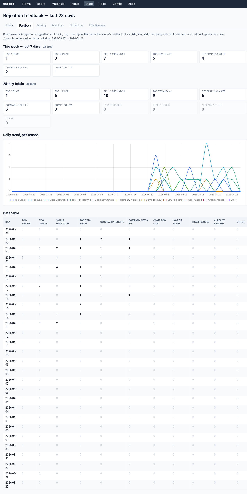

# findajob

Self-hosted infrastructure for a sane job search.

The modern job search grinds people down — hundreds of listings per day, most irrelevant; the same cover letter rewritten at midnight; no memory of which companies went silent weeks ago; no signal about whether the rejections mean "wrong skill," "wrong level," or "wrong field." Burnout is the default. findajob absorbs the triage, the tailoring, and the tracking so your attention goes to the few applications actually worth sending.

LinkedIn, Indeed, Greenhouse, and Gmail flow in; a local LLM filters out the noise; a web UI lets you triage, prep, and track. Runs as a Docker container on any Linux host. ~$0.50–2/day in API usage.

> **Status:** Pre-1.0. Used daily by the operator; one external beta tester onboarded. General availability (a second non-technical user running their own instance end-to-end) is the next milestone.

---

## What it does

The pipeline narrows the funnel at every step where a human would otherwise waste attention — LLM triage on the way in, human triage on the way to prep, prep only for jobs worth applying to. Thirty days on the operator's instance looks like this:

| Stage transitions (30 days) | Count |
|---|---:|
| Jobs scored | **10,812** |
| Surfaced to operator (score ≥7) | 318 |
| Materials drafted (resume + cover letter + briefing) | 243 |
| Applied | **43** |
| Interview | 3 |
| User-rejected with feedback reason | 354 |
| Waitlisted (deferred) | 40 |

10,812 jobs narrowed to 43 applications in a month — triage cuts most of the noise, prep is only spent on jobs worth applying to, and the reject-with-reason flow feeds back into the scorer so its cuts keep improving. The prep step is LLM-assisted but user-gated: you never apply to a job the system chose for you.

---

## How it works

**1. Daily triage** (00:00, scheduler-driven) — fetches 100–500 listings from RapidAPI (LinkedIn + Indeed), Greenhouse, and Gmail job alerts; cleans + deduplicates; enriches with JD text; scores each against your `profile.md` using an LLM. Results land in SQLite.

**2. Dashboard triage** — the web UI shows every scored job that cleared the threshold, with relevance/fit/probability scores, known contacts, and AI notes. You flag the ones worth prepping.


**3. Prep** (on-flag) — launches `prep_application.py`, which generates a folder per job containing a tailored resume, cover letter, company briefing, and network-outreach drafts. Uses Claude Opus for writing, Perplexity for company research.

**4. Apply + track** — you submit the application, mark the job *Applied*. The Applied tab color-codes by days-since-submission so you can see at a glance which applications have gone silent too long.


**5. Reject with reason** — jobs that don't work out get rejected with a reason (*Skills Mismatch*, *Too Senior*, *Comp Too Low*, *Geography/Onsite*, etc.). Those reasons feed back into the next day's scorer as negative examples.

**6. Learn** — stats dashboards make the funnel and the rejection mix legible, so you can tell whether the scorer is drifting or whether a particular reason is spiking — a signal to tune the profile or retarget.




*Screenshots are from a fresh-install demo database seeded with fictional jobs across data center operations, social work, and K–12 education. No real employer or candidate data.*

---

## What you get out of it

- **One surface, every view.** Dashboard, Applied, Waitlist, Review, Rejected, Archive — each is a filtered view of the same SQLite table. Sorting, filtering, and density toggles are URL query params, so any view is bookmarkable.
- **Materials live with the pipeline.** Generated folders stay on your Docker host; the web UI renders Markdown inline and serves `.docx` downloads.
- **Feedback loop, not a black box.** Every rejection is a labeled training example for tomorrow's scorer. Every manual-review flag tells you which parts of your profile are ambiguous to the LLM.
- **Domain-neutral.** The pipeline was built by a data center ops candidate but is designed to generalize — a social worker, teacher, or accountant profile slots in the same way. See [`docs/GENERALIZATION.md`](docs/GENERALIZATION.md) for the current state of that work.
- **Your data stays local.** SQLite on your Docker host. The only outbound calls are to the LLM providers you've configured; the repo contains zero personal data.

---

## Stack

| Component | Choice |
|---|---|
| Scoring | DeepSeek v3.2 via OpenRouter (through [aichat-ng](https://github.com/blob42/aichat-ng)) |
| Resume + cover letter + outreach | Claude Opus / Sonnet 4.6 |
| Company research | Perplexity Sonar Pro |
| Embeddings (REPL RAG over your own writing) | Gemini Embedding |
| Storage | SQLite |
| Job sources | RapidAPI jobs-api14, Greenhouse JSON, Gmail OAuth2 |
| Web UI | FastAPI + HTMX + Tailwind + Chart.js |
| Push notifications | [ntfy.sh](https://ntfy.sh) |
| Scheduler | supercronic (in-container) |

---

## Quick start

The pipeline ships as `ghcr.io/brockamer/findajob` pulled via Docker Compose.

```bash
# On your Docker host
sudo mkdir -p /opt/stacks/findajob-<you>/state/{data,config,candidate_context,companies,logs,aichat_ng}
sudo chown -R $(id -u):$(id -g) /opt/stacks/findajob-<you>/
cd /opt/stacks/findajob-<you>

curl -fsSL -o compose.yaml https://raw.githubusercontent.com/brockamer/findajob/main/ops/compose.yaml.example
curl -fsSL -o .env         https://raw.githubusercontent.com/brockamer/findajob/main/ops/stack.env.example

# Populate state/ with API keys, personal config, candidate profile
# (templates + walkthrough in the install guide)
docker compose up -d
```

Full walkthrough → [`docs/setup/install-docker.md`](docs/setup/install-docker.md). Native-host install still supported → [`docs/setup/install-linux.md`](docs/setup/install-linux.md).

---

## Documentation

| Doc | Contents |
|---|---|
| [docs/architecture.md](docs/architecture.md) | System design, data flow, component map |
| [docs/setup/prerequisites.md](docs/setup/prerequisites.md) | API keys, accounts, tools you need |
| [docs/setup/install-docker.md](docs/setup/install-docker.md) | **Docker Compose setup (recommended)** |
| [docs/setup/install-linux.md](docs/setup/install-linux.md) | Native fallback (Ubuntu + systemd) |
| [docs/setup/configure.md](docs/setup/configure.md) | Profile, resume, search queries, API keys |
| [docs/setup/state-migration.md](docs/setup/state-migration.md) | Moving an existing pipeline to a new host |
| [docs/operations.md](docs/operations.md) | Day-to-day use, monitoring, common tasks |
| [docs/notifications.md](docs/notifications.md) | ntfy.sh setup and notification schedule |
| [docs/GENERALIZATION.md](docs/GENERALIZATION.md) | Making the pipeline work for non-tech fields |
| [docs/claude-code.md](docs/claude-code.md) | Using Claude Code as a pipeline operator |

---

## What it costs to run

Real-world per-day usage on the operator's instance, ~10k jobs/month scored:

| Item | Typical day |
|---|---|
| Scoring (DeepSeek via OpenRouter) | $0.10–0.30 |
| Company research (Perplexity Sonar Pro) | $0.10–0.20 per prepped job |
| Prep writing (Claude Opus) | $1.50–3.00 per prepped job |
| Embeddings rebuild (Gemini) | ~$0.01/week |

Total: ~$0.50/day when triaging only; ~$5–15 on days you prep a few applications.

---

## Privacy

The repository contains no personal data. All candidate content (resume, profile, writing samples, search queries, API keys) lives in gitignored paths populated from `.example` templates. See [`docs/claude-code.md`](docs/claude-code.md) for how to keep personal context out of Claude Code sessions touching this repo.

---

## License

MIT.
