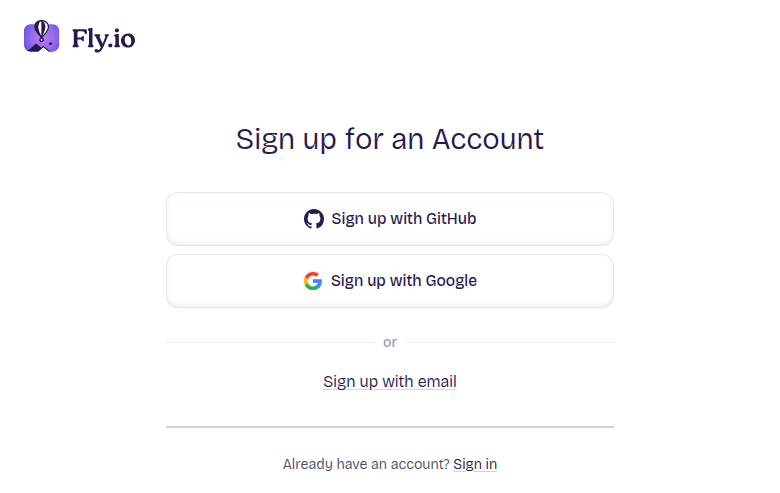
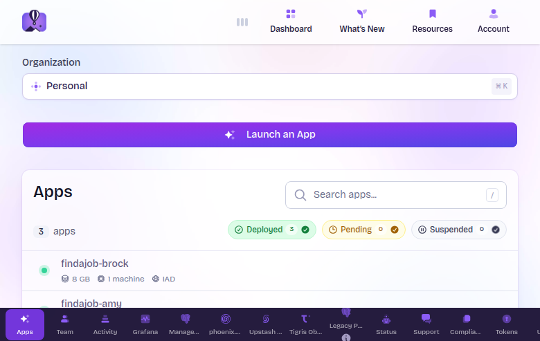
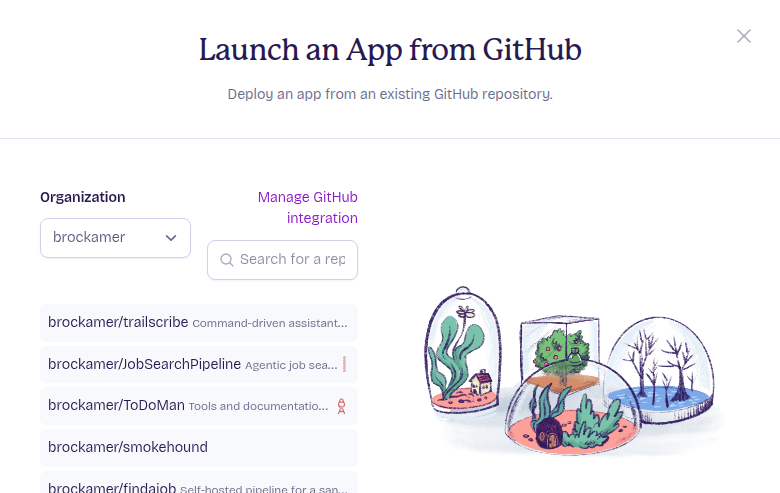
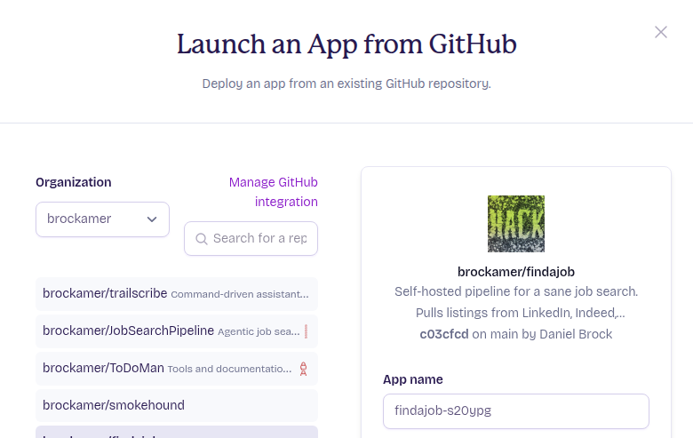
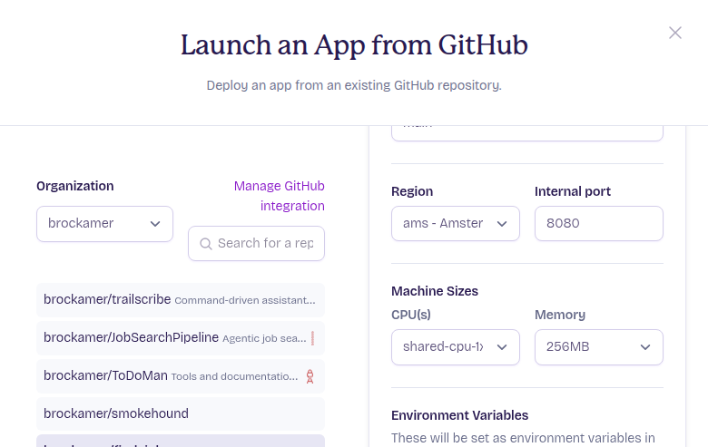
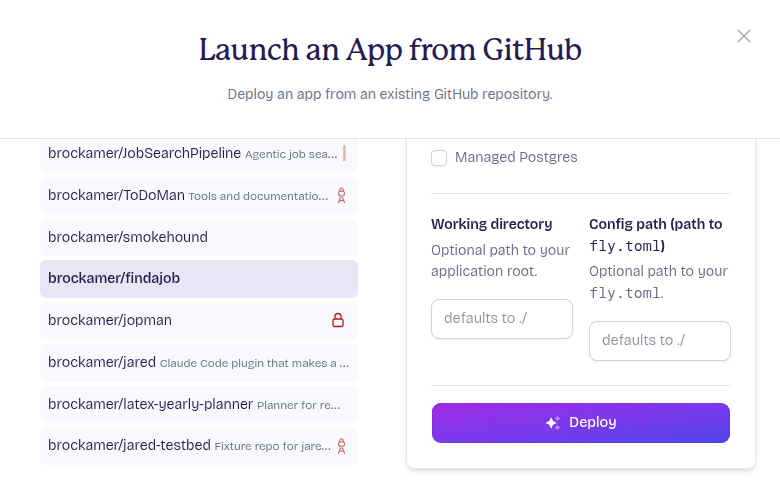
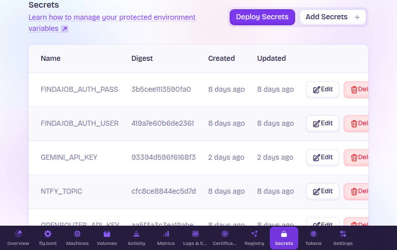
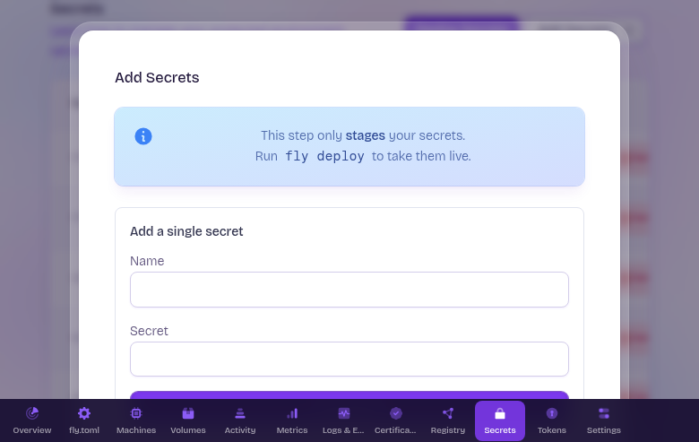
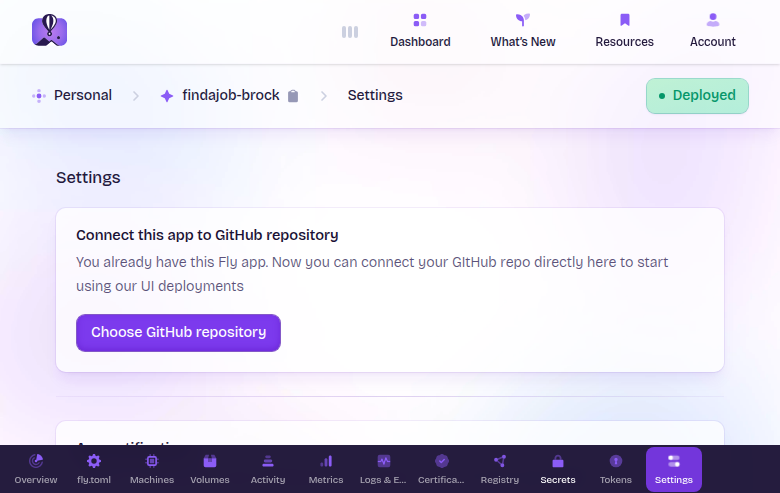

# Install on Fly.io

The hosted path: findajob runs as one app per person on [Fly.io](https://fly.io/), reachable at a `findajob-<your-handle>.fly.dev` URL with HTTPS terminated by Fly. You don't operate a Linux server. You pay Fly directly for the machine + 8 GB volume, and your LLM provider directly for AI calls — no middleman.

**Time to value: ~20 minutes to first onboarding screen, ~2 hours total to a populated dashboard.** Deploy takes ~10 minutes through the Fly.io web dashboard (no terminal required). The in-app onboarding interview that follows takes 60–90 minutes (one-time, ~$3–6 of OpenRouter spend — make sure you've added at least $10 of credit to your OpenRouter wallet before starting; OpenRouter is pay-as-you-go, so you're funding a balance the system draws from). Your dashboard fills overnight when the daily triage runs at midnight in your timezone.

This page is for someone who has never deployed anything to Fly before. If you operate Linux servers and would rather run a docker-compose stack on a host you own, see [`install-docker.md`](../operations/install-docker.md) instead. Both paths run the same image and reach the same dashboard.

---

## Who this is for

- You want findajob, but you don't want to run a server.
- You have a credit card and ~$5/month of budget room for hosting (LLM API spend is separate and you control it).
- You can follow step-by-step instructions in a web browser. No terminal or command line needed.

## Who this is NOT for

- "Free tier only" expectations. Fly removed the free allowance in late 2024; expect ~$3–5/month minimum for the always-on machine + volume even if findajob is idle. See [Cost](#cost) below.
- Multi-user / multi-tenant on one app. findajob is single-occupant by design — one Fly app per user, one volume per app, one job-search workspace per volume.

## What you'll need before you start

Have these ready (you'll enter them after the initial deploy):

1. **A Fly.io account with billing enabled.** Sign up at <https://fly.io/app/sign-up>, then after signing in click **Billing** in the left nav of your Fly dashboard and add a card. Trial orgs without a card on file are rejected at deploy time.

   

2. **An OpenRouter API key** for LLM calls. Pay-as-you-go from $0 (no monthly minimum). Sign-up walkthrough: [`api-keys.md`](api-keys.md#openrouter).
3. **A RapidAPI key** (optional, for LinkedIn / Indeed / Bing search ingestion). BASIC plan is 150 requests/month free, no credit card. Skipping it means LinkedIn / Indeed search is inactive — Greenhouse / Ashby / Lever and Gmail alerts still work. Walkthrough: [`api-keys.md`](api-keys.md#rapidapi).
4. **An ntfy topic for push notifications** (optional). findajob uses [ntfy.sh](https://ntfy.sh/) — a free notification service — to send alerts to your phone. Install the free ntfy app on Android or iOS, then pick a "topic name" that only you and findajob will know (e.g. `findajob-jane-2026-19`). **You can skip this** and configure ntfy later — see [`notifications.md`](notifications.md).
5. **A basic-auth username and password.** Anyone with this credential can reach your dashboard. Pick a short username (like your first name) and a strong password (24+ characters — a passphrase like `correct-horse-battery-staple` works).

---

## 1. Sign in to Fly.io

Go to <https://fly.io/app/sign-in> and sign in with the account you created. You'll land on your Fly dashboard.

## 2. Launch the app

Click the purple **Launch an App** button at the top of your dashboard.



In the dialog that opens:

1. **Select the findajob repository.** If you have a GitHub account and have forked `brockamer/findajob`, select your fork. If you're using the public repo, select the Organization dropdown and choose **"Use a public repo"**, then paste `brockamer/findajob`.

   

2. **Configure the deploy** — only three fields need attention:

   

   - **App name:** Change to `findajob-<your-handle>` (e.g. `findajob-jane`). Must be globally unique — lowercase letters, digits, hyphens only.
   - **Region:** Pick the one nearest you. US East → `iad` (Ashburn, VA). US West → `lax` (Los Angeles). Europe → `ams` (Amsterdam).
   - **Memory:** Change from 256MB to **1GB**.

   

   Leave everything else as-is — including the **Internal port** (the shown default is correct; don't change it). The repo's `fly.toml` provides the volume (8 GB) and machine size.

   > **If the form shows a "Variables" / "Environment variables" section (Name + Value), leave it blank.** API keys go in **Secrets** after the deploy (next section), not here — anything typed here just becomes an unused environment variable.

   

3. **Click Deploy.** Fly creates the app, provisions an 8 GB volume, builds the image, and starts the machine. This takes 2–4 minutes. You'll see a live progress page with build steps.

## 3. Add your secrets

Once the deploy completes, navigate to your app in the Fly dashboard (click the app name in the top-left breadcrumb, or go to `https://fly.io/apps/findajob-<your-handle>`), then click the **Secrets** tab in the left nav.



Click **Add Secrets** to add each of the following. Enter the name exactly as shown, paste your value, and click Add:

| Name | Required? | Value |
|------|-----------|-------|
| `OPENROUTER_API_KEY` | **Yes** | Your OpenRouter API key |
| `FINDAJOB_AUTH_USER` | Optional | Your chosen username (e.g. `jane`) — can also be set during onboarding |
| `FINDAJOB_AUTH_PASS` | Optional | Your chosen password (24+ characters) — can also be set during onboarding |
| `RAPIDAPI_KEY` | Optional | Your RapidAPI key |
| `NTFY_TOPIC` | Optional | Your ntfy topic name |



After adding all secrets, click the **Deploy Secrets** button at the top of the Secrets page. This restarts your machine with the secrets active — the auth gate and LLM calls will now work.

> **Auth credentials are optional at deploy time.** If you skip `FINDAJOB_AUTH_USER` and `FINDAJOB_AUTH_PASS` here, the onboarding flow will prompt you to set a username and password as its first step. To prevent anyone else who finds your URL from setting your password before you do, the auth-setup form requires a one-time setup token that's printed to your container logs — find it with `fly logs --app findajob-<your-handle> | grep FINDAJOB_SETUP_TOKEN`. Setting auth secrets here avoids that step entirely.

## 4. First browser visit

Open `https://findajob-<your-handle>.fly.dev/` in your browser. If you set auth credentials as secrets, you'll be prompted to log in. Otherwise, the onboarding flow will ask you to set a password first. Either way, the dashboard redirects to `/onboarding/` — this is the start of the in-app interview.

## 5. Onboarding

The onboarding flow is a structured 60–90 minute LLM conversation that writes your `profile.md`, role prompts, and other config files based on your career history. Plan to sit through it in one session, or use the "resume" affordance to come back later.

**Step 0 — Set your password** (if you didn't set `FINDAJOB_AUTH_USER` / `FINDAJOB_AUTH_PASS` as Fly secrets). The form asks for a one-time setup token from your container logs (drive-by squat defense — paste the value of `FINDAJOB_SETUP_TOKEN` from `fly logs --app findajob-<your-handle>`), then a username and password (at least 8 characters). After saving, your browser will prompt you to log in with those credentials. This step is skipped if auth credentials are already in the environment.

**Step 1 — API keys.** The onboarding screen detects the `OPENROUTER_API_KEY` and `RAPIDAPI_KEY` you set as secrets (read from the container's environment). It shows the last 4 characters of each as confirmation and a **Use detected keys** button. Click it to advance to Step 2 without re-typing.

**Step 2 — Run the interview.** Click "Start interview." A chat surface opens. The interviewer asks structured questions about your work history, target companies, skills, and preferences, emitting config blocks as you go. You can close the tab anytime — the session is server-side persistent:


As the interview progresses, a progress bar tracks the config blocks emitted so far:


When all blocks are complete, a green "Finalize" button appears:


Clicking Finalize writes your config files to the volume and kicks off initial company discovery (a one-time LLM run that drafts a `discovered_companies.md` list). Then findajob hands off to the Gmail-config gate.

**Gmail-config gate (optional).** Configure IMAP credentials so findajob can ingest LinkedIn / Indeed / etc. job-alert emails directly, and auto-detect ATS rejection emails. Save and "Test connection" to advance, or Skip:


See [`gmail.md`](gmail.md) for the 2FA + app-password procedure. Gmail integration is off by default — Greenhouse, Ashby, Lever, and RapidAPI LinkedIn search cover most volume without it.

**Step 3 — LinkedIn connections (optional).** The final step. Upload your `Connections.csv` from a LinkedIn data export. findajob uses it to find people in your network at companies that posted jobs, and drafts outreach. Skippable. On upload or Skip, you land on the dashboard:


**Cost note for onboarding.** The interview itself runs **~$3–6 in OpenRouter spend** (system-prompt caching at OpenRouter keeps subsequent turns cheap; long interviews push the high end). Detail: [`cost.md`](cost.md).

## 6. Verify and wait for first triage

After onboarding lands you on the dashboard, the feed is empty — no jobs have been triaged yet. By default, triage runs at **midnight America/New_York** (the timezone set by the `fly.toml` `[env].TZ` value).

After you complete onboarding, the timezone you gave drives this instead: it's
saved and applied on your next app restart (restart from the Fly dashboard to
apply it immediately). The `[env].TZ` value is just the default until then.

**The dashboard tells you what to do.** A blue banner above the (empty) job table shows when the next scheduled triage will fire and includes a **Trigger triage now** button. Click it to start the pipeline immediately rather than wait for the cron cycle.

**Plan for 5–60 minutes** on the first run — the wide range depends on how many target companies you named in the onboarding interview (more companies → more Greenhouse / Ashby feeds to walk → more jobs to score). Smaller named lists finish in 5–15 minutes. Subsequent daily runs are delta-only and complete in 1–5 minutes.

When it finishes, refresh `/board/` and you should see a scored shortlist (typically 20–50 jobs at score ≥ 5 out of several hundred to a few thousand ingested).

## 7. Daily operation

This page is the install runbook. Once you're up:

- **Web UI** — primary surface. `/board/` for jobs, `/config/` to edit profile / roles / queries without shelling in, `/stats/` for cost tracking.
- **Usage walkthrough** — [`../usage.md`](../usage.md) is the tab-by-tab daily workflow.
- **Notifications** — ntfy push to your phone every morning at 06:00 stack-time with the day's high-scoring shortlist.

---

## Updating to a new release

findajob keeps releasing updates. Two ways to pull new versions — pick whichever fits:

**Web (recommended).** In your app's Settings page, connect your GitHub repo and enable **Auto-Deploy on push**. Every time a new release lands on the `main` branch, Fly redeploys your app automatically.



**Manual redeploy from dashboard.** Navigate to your app's overview page and click the deploy button if your repo is connected, or re-run the Launch flow.

<details>
<summary>Power-user: update via CLI</summary>

If you have `flyctl` installed:

```
fly deploy --config ops/fly.toml
fly ssh console --app findajob-<your-handle> --command "python -m findajob.web.verify_auth"
```

If `verify_auth` exits non-zero, the deploy is up but the auth gate is broken — roll back.

</details>

Release notes are at <https://github.com/brockamer/findajob/blob/main/CHANGELOG.md>. Releases with schema or config migrations call them out in a `### Migration required` block — read that section before updating.

---

## Cost

**You can cap monthly LLM spend at any dollar amount via `/settings/spend-ceiling/` in the web UI — the pipeline halts new LLM calls when the running monthly total crosses your cap.** Set this before your first triage if you want a hard ceiling. Below is the per-component breakdown for sizing your cap.

Two cost categories, both controllable:

**Fly hosting** — roughly $3–5/month per app on the defaults:
- `shared-cpu-1x` 1 GB machine, always-on: ~$3.19/mo
- 8 GB volume: ~$1.20/mo
- Bandwidth: typically $0 (the free tier covers low-egress per-tenant traffic)

Verify current Fly pricing at <https://fly.io/docs/about/pricing/>.

**LLM spend** — depends on your cadence:
- Daily triage only (scoring a typical day's job intake): order-of-magnitude $0.30–$1/day
- Per fully-prepped job (briefing + tailored resume + cover + recruiter critique + outreach): ~$0.80–$1.20 per prep (see [`cost.md`](cost.md) for the breakdown)
- Onboarding interview (one-time): ~$3–6

See [`cost.md`](cost.md) for the full breakdown with `cost_log`-grounded ranges.

## Troubleshooting

- **Deploy fails with "This functionality is disabled for trial organizations"** — billing isn't enabled on your Fly org. Add a credit card at your Fly dashboard's Billing page and retry.
- **Browser sees `Connection refused` after deploy** — the machine may still be cold-starting. Wait 60 seconds and retry.
- **A deploy fails or times out** — first deploys occasionally hit a transient Fly builder/registry hiccup. Re-run the deploy; it usually clears on a retry. If it persists, the **CLI deploy** path below pulls findajob's prebuilt image (`ops/fly.toml`'s `[build] image`) instead of building, which sidesteps build/registry issues entirely.
- **OpenRouter calls fail with `402 PaymentRequired`** — your OpenRouter balance is exhausted. Top up at <https://openrouter.ai/credits>. The onboarding interview handles this gracefully; daily triage does not — it logs and continues at the next cycle.
- **Secrets not taking effect** — after adding secrets on the Secrets page, you must click **Deploy Secrets** to restart the machine. Secrets are staged until deployed.

For symptoms not listed here, see [`../troubleshooting.md`](../troubleshooting.md).

---

<details>
<summary>Alternative: CLI deploy (power users)</summary>

If you prefer the command line, the full CLI-based deploy path is available. Install `flyctl`, clone the repo, and run the deploy script:

```
# Install flyctl
curl -L https://fly.io/install.sh | sh   # Linux
brew install flyctl                       # macOS

# Authenticate
fly auth login

# Clone and configure
git clone https://github.com/brockamer/findajob.git
cd findajob
cp ops/fly.toml.example ops/fly.toml
# Edit ops/fly.toml — change app = "findajob-<your-handle>"

# Deploy (creates app, volume, prompts for secrets, deploys, verifies auth)
bash ops/fly-deploy.sh
```

The script is idempotent — safe to re-run. It creates the app, provisions the volume, prompts for each secret, runs `fly deploy`, and verifies the auth gate.

For deeper CLI operations — secret rotation, volume resize, per-tenant teardown — see the operator-tier runbook at [`../operations/fly-deploy.md`](../operations/fly-deploy.md).

</details>
