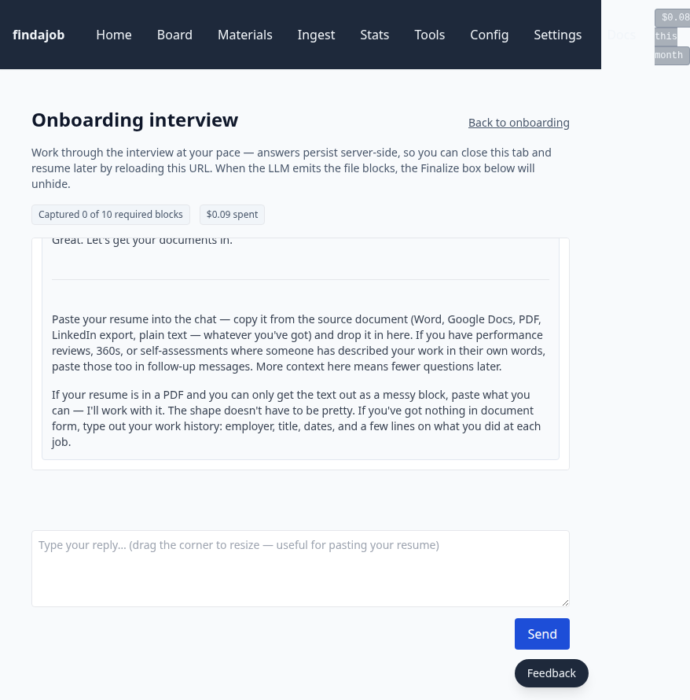
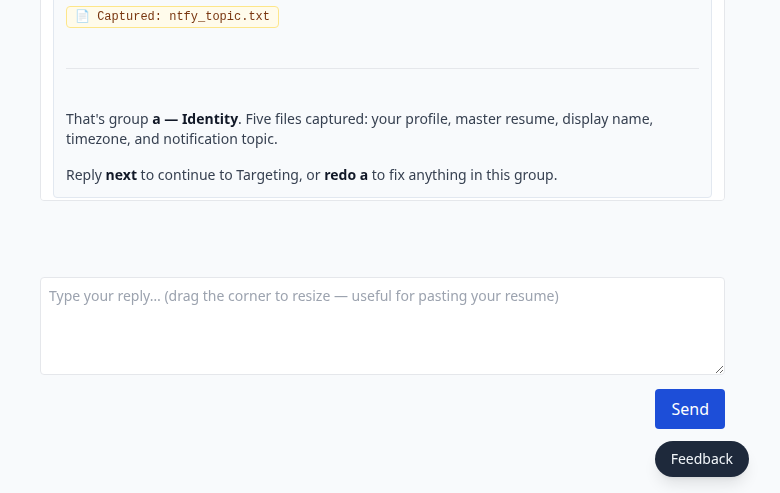
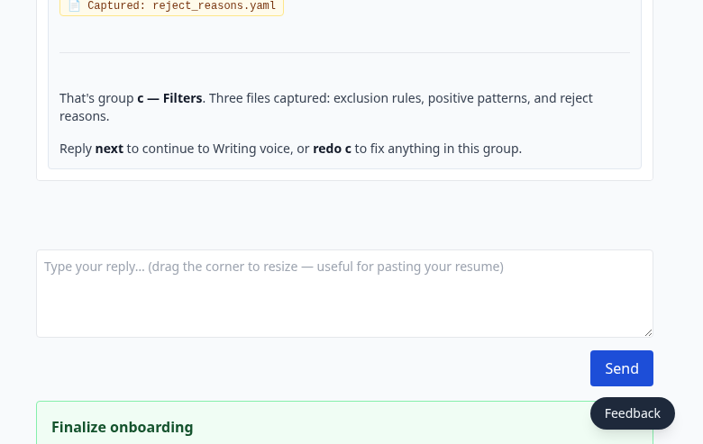
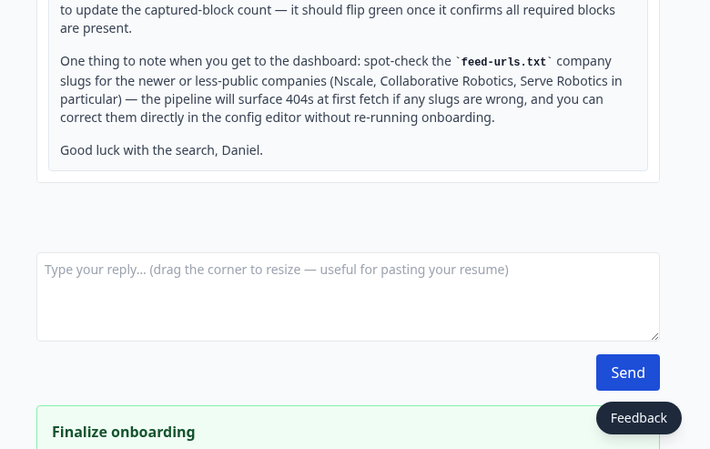
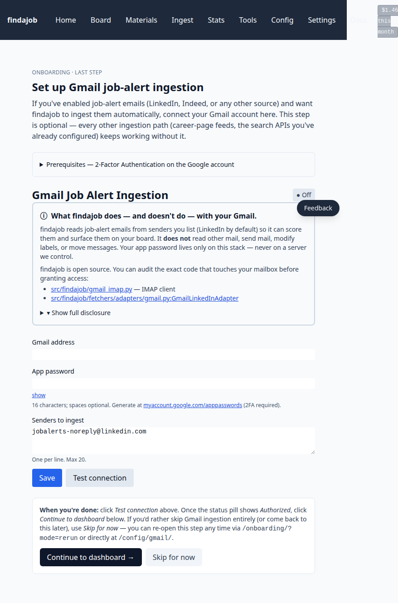
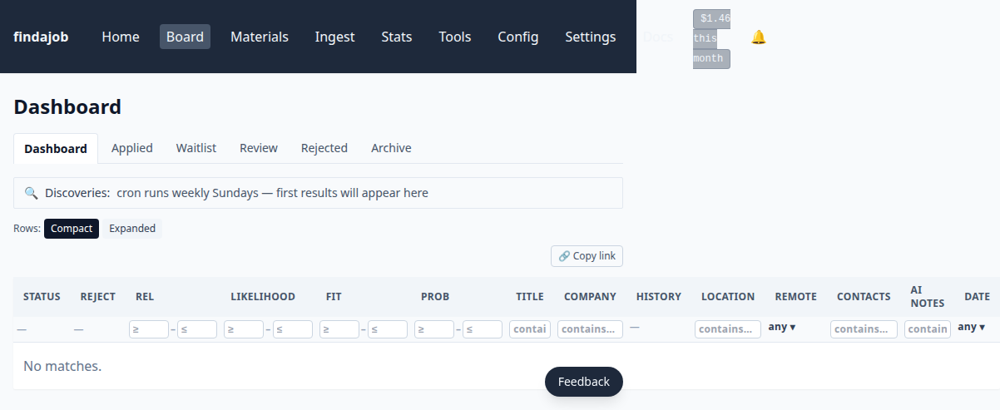

# Install on Fly.io

The hosted path: findajob runs as one app per person on [Fly.io](https://fly.io/), reachable at a `findajob-<your-handle>.fly.dev` URL with HTTPS terminated by Fly. You don't operate a Linux server. You pay Fly directly for the machine + 8 GB volume, and your LLM provider directly for AI calls — no middleman.

**Time to value: ~20 minutes to first onboarding screen, ~2 hours total to a populated dashboard.** Setup + deploy takes ~20 minutes from `fly auth login` through to the auth gate. The in-app onboarding interview that follows takes 60–90 minutes (one-time, ~$3–6 of OpenRouter spend — make sure you've topped up at least $10 before starting). Your dashboard fills overnight when the daily triage runs at midnight in your timezone.

This page is for someone who has never deployed anything to Fly before. If you operate Linux servers and would rather run a docker-compose stack on a host you own, see [`install-docker.md`](install-docker.md) instead. Both paths run the same image and reach the same dashboard.

---

## Who this is for

- You want findajob, but you don't want to run a server.
- You have a credit card and ~$5/month of budget room for hosting (LLM API spend is separate and you control it).
- You're comfortable with a handful of command-line steps. There is no GUI for the deploy itself — Fly is operated with `fly` on your laptop.

## Who this is NOT for

- "Free tier only" expectations. Fly removed the free allowance in late 2024; expect ~$3–5/month minimum for the always-on machine + volume even if findajob is idle. See [Cost](#cost) below.
- Multi-user / multi-tenant on one app. findajob is single-occupant by design — one Fly app per user, one volume per app, one job-search workspace per volume.

## What you'll need before you start

Collected before you run the deploy script (it'll prompt for each):

1. **A Fly.io account with billing enabled.** Sign up at <https://fly.io/app/sign-up>, then add a credit card at `https://fly.io/dashboard/<your-org-slug>/billing`. Trial orgs without a card on file are rejected by `fly deploy` with HTTP 422 — fix this before starting.
2. **An OpenRouter API key** for LLM calls. Pay-as-you-go from $0 (no monthly minimum). Sign-up walkthrough: [`api-keys.md`](api-keys.md#openrouter).
3. **A RapidAPI key** (optional, for LinkedIn / Indeed / Bing search ingestion). BASIC plan is 150 requests/month free, no credit card. Skipping it means LinkedIn / Indeed search is inactive — Greenhouse / Ashby / Lever and Gmail alerts still work. Walkthrough: [`api-keys.md`](api-keys.md#rapidapi).
4. **An ntfy topic** for push notifications. Free at <https://ntfy.sh/>; pick a long random string as the topic (e.g. `findajob-jane-2026-19`) — anyone who guesses the topic name can read your notifications.
5. **A basic-auth username and password.** Anyone with this credential can reach your dashboard and reconfigure the pipeline. The deploy script generates the password if you let it (`openssl rand -base64 32`); pick a short username like your first name.

A handful of these (OpenRouter + RapidAPI + ntfy + auth) are collected at deploy time so the first browser visit lands on the auth gate, not a half-configured screen.

---

## 1. Install flyctl on your laptop

flyctl is the command-line tool that drives the deploy. Install for your OS:

```
# macOS (Homebrew)
brew install flyctl

# Linux
curl -L https://fly.io/install.sh | sh

# Windows (PowerShell)
iwr https://fly.io/install.ps1 -useb | iex
```

The Fly installer page (<https://fly.io/docs/flyctl/install/>) has alternative installers and PATH-troubleshooting tips if any of the above don't work. After installing:

```
fly version            # confirm install
fly auth login         # opens a browser to sign in
fly auth whoami        # confirms you're logged in
```

`fly auth login` returns you to the terminal once your browser tab confirms. If `whoami` shows your email, you're set.

## 2. Clone the repo

You need a local working tree because the deploy reads `ops/fly.toml` from disk:

```
git clone https://github.com/brockamer/findajob.git
cd findajob
```

You won't edit pipeline code — only the `ops/fly.toml` config to set your app name.

## 3. Configure your app name

Copy the example fly.toml and pick a handle. The handle is the leftmost label of your URL — `findajob-jane.fly.dev` if your handle is `jane`:

```
cp ops/fly.toml.example ops/fly.toml
$EDITOR ops/fly.toml
```

Change one line:

```
app = "findajob-<your-handle>"
```

`<your-handle>` must be globally unique across Fly. Lowercase letters, digits, hyphens; no underscores. If `findajob-jane` is taken, try `findajob-jane-<year>` or initials.

Don't change anything else in `fly.toml` for a first deploy. The defaults — `shared-cpu-1x` 1 GB machine, 8 GB volume, `auto_stop_machines = "off"` so cron jobs run — are what the next step expects.

## 4. Run the deploy script

One command:

```
bash ops/fly-deploy.sh
```

The script is idempotent — safe to re-run. On a clean run it:

1. Creates the Fly app under the slug you set in `fly.toml`. (No confirmation prompt — a typo there consumes a wrong slug on your account; verify `app =` is exactly what you want before running. Re-typing the slug is fine, but you'll need to `fly apps destroy` the wrong one first.)
2. Creates the `findajob_state` volume (8 GB, holds all your data).
3. Prompts you for each secret you haven't already set (`OPENROUTER_API_KEY`, `RAPIDAPI_KEY`, `NTFY_TOPIC`, `FINDAJOB_AUTH_USER`, `FINDAJOB_AUTH_PASS`). Each is stored in Fly's encrypted secrets store, not in `fly.toml` or your shell history.
4. Runs `fly deploy`. First build pulls the image (~1 GB; takes 2–4 minutes), then the machine boots and runs `ops/entrypoint.sh` — which materializes the data subdirectories under `/app/state/` and creates an empty `pipeline.db`.
5. Verifies the basic-auth gate is wired correctly by SSH-ing into the machine and running `python -m findajob.web.verify_auth`. Non-zero exit means the auth gate is misconfigured — the script prints debugging commands and exits without claiming success.

On success, the script prints your URL: `https://findajob-<your-handle>.fly.dev/`.

## 5. First browser visit

Open the URL. Your browser asks for the basic-auth credential you just set — username + password. After login, the dashboard 307-redirects to `/onboarding/` because the stack has no profile yet. This is the start of the in-app interview.

## 6. Onboarding

The onboarding flow is a structured 60–90 minute LLM conversation that writes your `profile.md`, role prompts, and other config files based on your career history. Plan to sit through it in one session, or use the "resume" affordance to come back later.

**Step 1 — API keys.** Your first onboarding screen detects the `OPENROUTER_API_KEY` and `RAPIDAPI_KEY` you set during the deploy (read from the container's environment — Fly secrets surface there). It shows the last 4 characters of each as confirmation and a **Use detected keys** button. Click it to advance to Step 2 without re-typing. To enter different keys (e.g., you mistyped one or want to rotate), click **Enter keys manually instead** for the empty form.

**Step 2 — Run the interview.** Click "Start interview." A chat surface opens. The interviewer asks structured questions about your work history, target companies, skills, and preferences, emitting config blocks as you go. You can close the tab anytime — the session is server-side persistent, and the index page surfaces a "Resume your interview" button:



As the interview progresses, a progress bar tracks the config blocks emitted so far:



When all blocks are complete, a green "Finalize" button appears:





Clicking Finalize writes your config files to the volume and kicks off initial company discovery (a one-time LLM run that drafts a `discovered_companies.md` list). Then findajob hands off to the Gmail-config gate.

**Gmail-config gate (optional).** Configure IMAP credentials so findajob can ingest LinkedIn / Indeed / etc. job-alert emails directly, and auto-detect ATS rejection emails. Save and "Test connection" to advance, or Skip:



See [`gmail.md`](gmail.md) for the 2FA + app-password procedure. Gmail ingestion is always opt-out — Greenhouse, Ashby, Lever, and RapidAPI LinkedIn search cover most volume without it.

**Step 3 — LinkedIn connections (optional).** The terminal step. Upload your `Connections.csv` from a LinkedIn data export. findajob uses it to find people in your network at companies that posted jobs, and drafts outreach. Skippable. On upload or Skip, you land on the dashboard:



**Cost note for onboarding.** The interview itself runs ~$3–6 in OpenRouter spend even with prompt caching enabled (the system prompt is cached server-side at OpenRouter so subsequent turns are billed at ~10% of system tokens, but the cumulative chat history and voice-sample emission dominate the bill in long interviews).

## 7. Verify and wait for first triage

After onboarding lands you on the dashboard, the feed is empty — no jobs have been triaged yet. By default, triage runs at midnight in your stack's timezone.

**The dashboard tells you what to do.** A blue banner above the (empty) job table shows when the next scheduled triage will fire and includes a **Trigger triage now** button. Click it to start the pipeline immediately rather than wait for the cron cycle.

**Plan for 5–60 minutes** on the first run — the wide range depends on how many target companies you named in the onboarding interview (more companies → more Greenhouse / Ashby feeds to walk → more jobs to score). Engineering / hyperscaler-flavored candidates with 20+ named companies often see 30–45 minutes; smaller named lists finish in 5–15. Subsequent daily runs are delta-only and complete in 1–5 minutes.

When it finishes, refresh `/board/` and you should see a scored shortlist (typically 20–50 jobs at score ≥ 5 out of several hundred to a few thousand ingested).

<details>
<summary>Power-user: trigger from the command line</summary>

If you prefer the CLI or your stack's web UI is down:

```
fly ssh console --app findajob-<your-handle> --command "python3 /app/scripts/triage.py"
```

This is equivalent to clicking the dashboard's **Trigger triage now** button — same script, same logs, same `pipeline.jsonl` events.

</details>

## 8. Daily operation

This page is the install runbook. Once you're up:

- **Web UI** — primary surface. `/board/` for jobs, `/config/` to edit profile / roles / queries without shelling in, `/stats/` for cost tracking.
- **Usage walkthrough** — [`../usage.md`](../usage.md) is the tab-by-tab daily workflow.
- **Notifications** — ntfy push to your phone every morning at 06:00 stack-time with the day's high-scoring shortlist.

---

## Cost

Two cost categories, both controllable:

**Fly hosting** — roughly $3–5/month per app on the defaults:
- `shared-cpu-1x` 1 GB machine, always-on: ~$3.19/mo
- 8 GB volume: ~$1.20/mo
- Bandwidth: typically $0 (the free tier covers low-egress per-tenant traffic)

Verify current Fly pricing at <https://fly.io/docs/about/pricing/>.

**LLM spend** — depends on your cadence:
- Daily triage only (scoring a typical day's job intake): order-of-magnitude $0.30–$1/day
- Per fully-prepped job (briefing + tailored resume + cover + recruiter critique + outreach): ~$1–2 per prep
- Onboarding interview (one-time): ~$3–6

See [`cost.md`](cost.md) for the full breakdown with `cost_log`-grounded ranges, and [`../operations/fly-deploy.md#cost-guide`](../operations/fly-deploy.md#cost-guide) for the operator-tier reference table.

You can cap monthly LLM spend at any dollar amount on the `/settings/spend-ceiling/` page in the web UI — the pipeline halts new LLM calls when the running monthly total crosses the cap. The dashboard prompts you to set a ceiling on first visit if one isn't configured yet.

## Updating to a new release

`ops/fly.toml` ships pinned to `:latest`. To pull the current image:

```
fly deploy --config ops/fly.toml
fly ssh console --app findajob-<your-handle> --command "python -m findajob.web.verify_auth"
```

If `verify_auth` exits non-zero, the deploy is up but the auth gate is broken — roll back. Don't leave a stack live without a verified gate.

Release notes are at <https://github.com/brockamer/findajob/blob/main/CHANGELOG.md>. Releases with schema or config migrations call them out in a `### Migration required` block — read that section before updating.

## Rollback

If a deploy goes bad:

```
fly releases --app findajob-<your-handle>      # find your prior version
$EDITOR ops/fly.toml                            # set image to that prior tag
fly deploy --config ops/fly.toml
fly ssh console --app findajob-<your-handle> --command "python -m findajob.web.verify_auth"
```

A rollback is a re-deploy of the prior tag — Fly doesn't have a separate "rollback" primitive. Schema-breaking releases can't be rolled back this way; check the CHANGELOG `### Migration required` block before rolling forward in the first place.

## When you need more depth

This page covers the average install path. For deeper Fly operations — secret rotation, volume resize, per-tenant teardown, the docker-compose-to-fly command translation table — see the operator-tier runbook at [`../operations/fly-deploy.md`](../operations/fly-deploy.md). It assumes you're already comfortable operating the stack; come back here if you want the basics instead.

## Troubleshooting

- **`fly deploy` rejects with HTTP 422 "This functionality is disabled for trial organizations"** — billing isn't enabled on your Fly org. Add a credit card at `https://fly.io/dashboard/<your-org-slug>/billing` and retry.
- **`verify_auth` exits non-zero** — basic-auth env vars are missing or wrong. Re-run `bash ops/fly-deploy.sh` and re-enter the auth credential.
- **Browser sees `Connection refused` after deploy** — the machine may still be cold-starting. Wait 60 seconds and retry; check `fly status --app findajob-<your-handle>`.
- **OpenRouter calls fail with `402 PaymentRequired`** — your OpenRouter balance is exhausted. Top up at <https://openrouter.ai/credits>. The onboarding interview handles this gracefully; daily triage does not — it logs and continues at the next cycle.

For symptoms not listed here, see [`../troubleshooting.md`](../troubleshooting.md).
