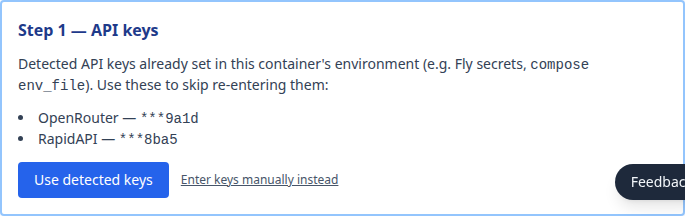
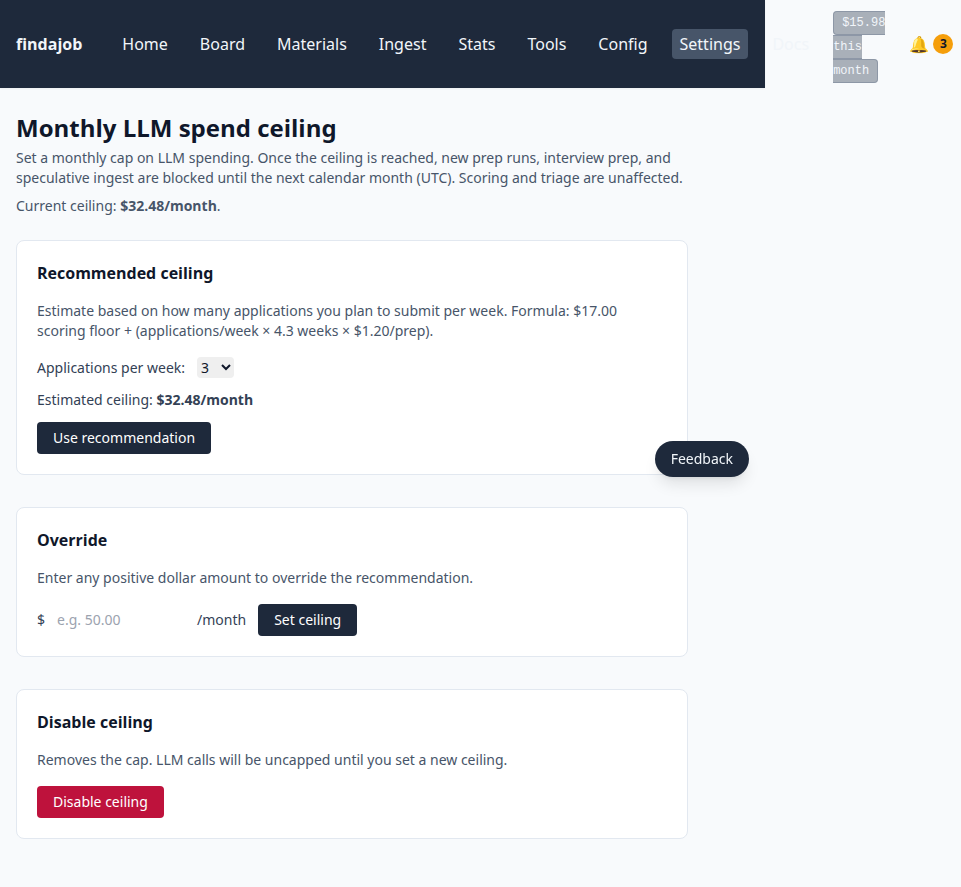
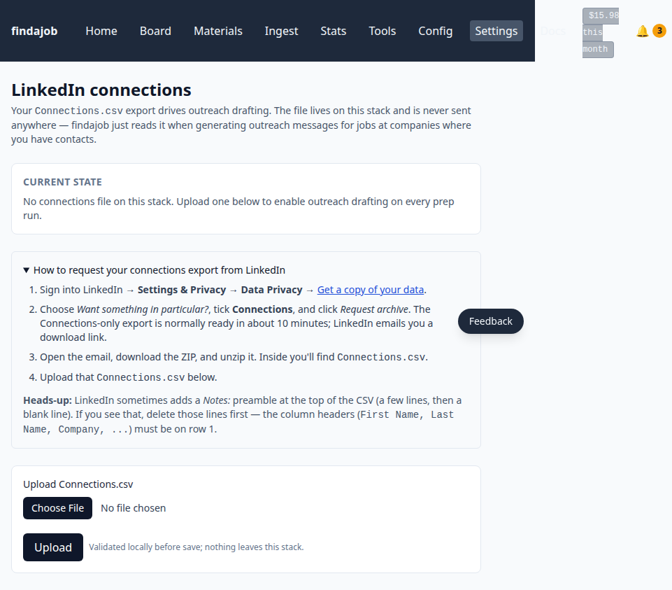

# Start here — deploy findajob to Fly.io

**No terminal or command line needed.** This is a step-by-step checklist that goes from "I just heard about findajob" to "my first scored job appears on my dashboard," with a screenshot at every screen and a "what to do if it didn't work" branch on every step. Everything happens in your web browser.

> If you prefer a denser reference-style runbook, see [`install-fly.md`](install-fly.md) instead. This page is the same procedure, just paced for first-timers.

**Plan ~2 hours start-to-finish.** Most of the calendar time is the onboarding interview, which is a 60–90 minute conversation with an AI. The first part of this checklist (account signups + deploy) takes ~15 minutes.

---

## Before you start: a 60-second readiness check

You'll need:

- [ ] A **credit card** (used for Fly.io hosting ~$5/mo + OpenRouter LLM spend ~$20–50/mo all-in for a typical user)
- [ ] About **2 hours of unbroken time** for the install + onboarding interview
- [ ] A **laptop or desktop** with a web browser
- [ ] A **resume in any text-extractable form** — Word, PDF, plain text, Google Doc; you'll paste it into the interview
- [ ] A **personal email** (for Fly + OpenRouter + RapidAPI signups; ~5 minutes total)

If any of those are no, stop here and come back when you have them — the install assumes them.

---

## Part A — Account signups (10 minutes)

### Step 1. Sign up for Fly.io and add a credit card *(5 min)*

findajob runs as one app per person on Fly.io. You need an account with billing enabled before the deploy script can create your app.

1. Go to <https://fly.io/app/sign-up> and create an account (email + password, or sign in with GitHub).
2. After signing in, click **Billing** in the left navigation of your Fly dashboard.
3. Click **Add credit card** and enter your card. There's no charge yet — the card is needed because trial Fly accounts can't deploy apps.

**What you should see:** your Fly dashboard with a Billing section showing your card on file.

**If something went wrong:** if you skip the billing step, `fly deploy` later returns `HTTP 422 "This functionality is disabled for trial organizations"`. Add the card and retry.

### Step 2. Sign up for OpenRouter and add $10 *(3 min)*

OpenRouter is the service that handles every AI call findajob makes (job scoring, resume writing, the onboarding interview itself). One signup covers all of them.

1. Go to <https://openrouter.ai/> and sign up.
2. Go to <https://openrouter.ai/credits> and add **at least $10** to your balance — that covers the onboarding interview ($3–6); **$20–$30 covers a typical first month of usage** after that.
3. Go to <https://openrouter.ai/keys> and **create a new API key**. Copy it somewhere you can paste it from later (the deploy script will ask).

**What you should see:** a balance ≥ $10 on the Credits page, and an API key starting with `sk-or-v1-...` saved somewhere you can find it.

**If something went wrong:** if your API key gets rejected later with `402 PaymentRequired`, your balance ran out. Top up at the same Credits page.

### Step 3. (Optional but recommended) Sign up for RapidAPI for LinkedIn search *(3 min)*

RapidAPI lets findajob ingest LinkedIn / Indeed / Bing job postings. Skipping this means findajob only ingests from direct ATS feeds (Greenhouse, Ashby, Lever, Workday) at companies you name during onboarding. **Most users want LinkedIn too** — it catches roles the direct feeds miss.

1. Go to <https://rapidapi.com/> and sign up (no credit card required for the free plan).
2. Visit the [jobs-api14 endpoint page](https://rapidapi.com/Pat92/api/jobs-api14) and click **Subscribe to Test**. Pick the **BASIC** plan (150 free requests/month, no card).
3. On the same page, find your **X-RapidAPI-Key** in the right-hand code samples. Copy that value.

**What you should see:** an active jobs-api14 subscription on the BASIC plan, and an API key starting with a long alphanumeric string saved somewhere you can find it.

**If something went wrong:** if you don't see the key in the code samples, click the **Endpoints** tab on the left sidebar and look in the request headers. The same key value appears there.

### Step 4. (Optional) Set up ntfy.sh for phone notifications *(2 min)*

findajob can push notifications to your phone — "new high-score job found," "monthly LLM spend ceiling reached," etc. Skippable; you can configure it later from the web UI.

1. Install the free **ntfy** app on Android or iOS.
2. Pick a "topic name" that only you and findajob will know. The topic acts as a channel ID — anyone who knows or guesses it can subscribe to your alerts, so make it hard to guess. A good shape: `findajob-<your-name>-<year>-<a number>`, e.g. `findajob-jamie-2026-19`.
3. In the ntfy app, subscribe to that topic name.

**What you should see:** the ntfy app shows your topic in its subscription list (no notifications yet — that's fine).

**Skip option:** to configure ntfy after the deploy is up, see [`notifications.md`](notifications.md).

---

## Part B — Deploy findajob (10 minutes)

Everything in this section happens in your web browser — no terminal or command line needed.

### Step 5. Launch the app from Fly's dashboard *(5 min)*

1. Sign in to your Fly dashboard at <https://fly.io/dashboard>.
2. Click the purple **Launch an App** button at the top.

   

3. **Select the findajob repository.** In the dialog that opens, find and click **brockamer/findajob** in the repo list. If you have a GitHub account with a fork, select your fork instead. If you don't have a GitHub account, select **"Use a public repo"** from the Organization dropdown, then enter `brockamer/findajob`.

   

4. **Configure three fields** in the right-hand panel:

   - **App name:** Change to `findajob-<your-handle>` (e.g. `findajob-jamie`). This becomes your URL — `findajob-jamie.fly.dev`. Must be globally unique; lowercase letters, digits, hyphens only.
   - **Region:** Pick the one nearest you. US East → `iad`. US West → `lax`. Europe → `ams`.
   - **Memory:** Change from 256MB to **1GB**.

   

   Leave everything else as-is — the `fly.toml` in the repo sets the correct port, volume, and machine size automatically.

5. Click the purple **Deploy** button at the bottom.

   

**What you should see:** a live deployment page with build steps progressing. This takes 2–4 minutes. When it finishes, you'll see "Deployed" in the breadcrumb at the top.

**If something went wrong:**

- **Deploy fails with "This functionality is disabled for trial organizations"** — billing isn't enabled on your Fly org. Go back to Step 1 and add a credit card.
- **App-name already taken** — try a different handle (e.g. add the year: `findajob-jamie-2026`). You can delete the failed app from Settings → Delete app and re-launch.

### Step 6. Add your API keys and password *(3 min)*

After the deploy finishes, navigate to your new app: click the app name in the breadcrumb at the top of the page, or go to `https://fly.io/apps/findajob-<your-handle>`.

1. Click the **Secrets** tab in the bottom nav bar.

   

2. Click **Add Secrets**. You'll see a dialog with Name and Secret fields:

   

3. Add each of the following secrets **one at a time** (type the Name exactly as shown, paste your value, click Add):

   | Name | Required? | What to enter |
   |------|-----------|---------------|
   | `OPENROUTER_API_KEY` | **Yes** | Your OpenRouter API key from Step 2 |
   | `FINDAJOB_AUTH_USER` | Optional | A short username for the web login (e.g. your first name) — can also be set during onboarding |
   | `FINDAJOB_AUTH_PASS` | Optional | A strong password, at least 8 characters — can also be set during onboarding |
   | `RAPIDAPI_KEY` | Optional | Your RapidAPI key from Step 3 |
   | `NTFY_TOPIC` | Optional | Your ntfy topic from Step 4 |

   > **Auth credentials are optional here.** If you skip them, the onboarding flow will prompt you to choose a username and password as its first step. The auth-setup form requires a one-time setup token printed to your container logs (find it with `fly logs --app findajob-<your-handle> | grep FINDAJOB_SETUP_TOKEN`) — this stops anyone else who finds your URL from setting your password before you do.

4. After adding all secrets, click the **Deploy Secrets** button at the top of the Secrets page. This restarts your app with the secrets active.

**What you should see:** the app status returns to "Deployed" after a few seconds.

**If something went wrong:** if you mistyped a secret value, click **Edit** next to it, correct it, and click **Deploy Secrets** again.

### Step 7. Verify your app is running *(1 min)*

Open `https://findajob-<your-handle>.fly.dev/` in your browser.

**What you should see:** if you set auth credentials in Step 6, your browser pops up a username/password dialog — enter those credentials. If you skipped auth, you'll land directly on the onboarding page which will ask you to set a password first. Either way, the dashboard redirects to `/onboarding/`.

**If something went wrong:** if the browser shows "Connection refused," the machine may still be restarting after the secrets deploy. Wait 60 seconds and retry.

---

## Part C — In-app onboarding (60–90 minutes)

### Step 8. Open your URL and sign in *(1 min)*

Open `https://findajob-<your-handle>.fly.dev/` in your browser (if you haven't already from Step 7).

**What you should see:** if you set auth credentials in Step 6, the browser asks for username/password. If you skipped auth, the onboarding page prompts you to set a password as its first step — after saving, the browser will ask you to log in with those credentials.

After signing in, the dashboard immediately redirects to `/onboarding/` because your stack has no profile yet.

**If something went wrong:** if the browser shows "Connection refused," the machine may still be restarting. Wait 60 seconds and retry.

### Step 9. Confirm your API keys *(1 min)*

The first onboarding screen detects the API keys you set in Step 6 and shows the last 4 characters of each as confirmation.

**What you should see:** "Detected: OpenRouter key ending …xxxx, RapidAPI key ending …xxxx" with a green **Use detected keys** button.

Click **Use detected keys** to advance.

**If something went wrong:** if you mistyped a key during deploy, click **Enter keys manually instead** and paste the correct value.

### Step 10. Run the onboarding interview *(60–90 min, ~$3–6)*

This is the longest step by far — and the one where findajob learns who you are.

1. Click **Start interview**. A chat window opens.
2. The AI asks structured questions about your work history, target companies, skills, and preferences. **Answer as completely as you reasonably can** — more context here means better job matching later.
3. When the interviewer asks for your resume, **paste it directly into the chat** (Word/PDF/plain text — copy from the source document, paste in).

**Plan to sit through it in one session.** If you have to step away, you can close the tab and the `Resume your interview` button on the index page brings you back exactly where you left off:

As the interview progresses, a progress bar tracks the config blocks emitted so far:

When all blocks are complete, a green **Finalize** button appears at the bottom of the chat:

Click **Finalize**. findajob writes your config files to disk and kicks off a one-time "company discovery" LLM run that drafts your initial target-company list.

**What you should see:** the page moves on to the spend-ceiling gate (next step).

**If something went wrong:** if the chat seems stuck (no LLM response for 30+ seconds), check `https://openrouter.ai/credits` — your balance may have run out. Top up and refresh the page; the conversation persists server-side.

### Step 11. Set a monthly spend ceiling *(1 min, recommended)*

This is the single biggest cost-anxiety defuse in findajob — a hard cap on your monthly LLM spend.

**Pick a dollar amount that won't make you nervous.** $30/mo is typical for a moderate user (daily triage + a few preps a week). The pipeline halts new LLM calls when the running monthly total crosses this cap. You can change it later at `/settings/spend-ceiling/`.

**What you should see:** the page advances to the Gmail-config gate.

**If something went wrong:** if you skipped this and want to set one later, visit `/settings/spend-ceiling/` in your web UI any time.

### Step 12. (Optional) Configure Gmail integration *(3 min)*

findajob can read your Gmail inbox to ingest LinkedIn / Indeed job-alert emails AND auto-detect ATS rejection emails.

To wire it up: see [`gmail.md`](gmail.md) for the 2FA + Gmail app-password procedure. Paste the credentials into this form, click **Test connection**, and **Save**.

**To skip:** click **Skip Gmail setup**. You can configure it later at `/config/gmail/`.

**What you should see:** the page advances to the LinkedIn connections step.

### Step 13. (Optional) Upload your LinkedIn Connections.csv *(2 min)*

findajob uses your LinkedIn network to find people at companies that posted jobs you're applying to, and drafts outreach to them.

1. In LinkedIn (on the web): **Settings → Data privacy → Get a copy of your data → Connections**. The CSV downloads after a few minutes.
2. On this onboarding step, click **Choose file** and select the downloaded `Connections.csv`.

**To skip:** click **Skip**. You can upload it later at `/onboarding/connections/`.

**What you should see:** the page advances to the dashboard.

**If something went wrong:** "Invalid CSV headers" usually means LinkedIn put a `Notes:` preamble at the top of the file. Open the CSV in any text editor, delete the lines before the header row (the one that starts with `First Name,Last Name,...`), save, and re-upload.

---

## Part D — Your first triage (5–60 minutes)

### Step 14. Trigger your first triage *(5–60 min, mostly waiting)*

You're now on the dashboard. The job table is empty — no jobs have been triaged yet.

**What you should see:** a blue banner above the (empty) job table with text like *"Your first triage hasn't run yet — next scheduled run is at 00:00 (your timezone)"* and a prominent **Trigger triage now** button below it.

Click **Trigger triage now** to start the pipeline immediately instead of waiting until midnight.

**How long this takes** depends on how many target companies you named during onboarding:

- 5–10 named companies: 5–15 minutes
- 20+ named companies (engineering / hyperscaler-flavored candidates): 30–45 minutes
- Up to ~60 minutes if you named a lot of companies AND included all the RapidAPI sources

Refresh `/board/` to see progress.

**What you should see when it finishes:** a scored shortlist, typically 20–50 jobs at score ≥ 5 out of several hundred to a few thousand ingested.

**If something went wrong:** if the dashboard still shows empty after 60+ minutes, check your app's **Logs & Errors** tab in the Fly dashboard to see what the pipeline is doing.

### Step 15. See your first scored jobs

Each row is a job that scored above your threshold. Click into one to see:

- The full job description
- findajob's per-criterion scoring rationale
- Known contacts in your network at that company
- A **Flag for prep** button that kicks off the one-click materials generation (briefing + tailored resume + cover letter + recruiter critique + outreach drafts)

---

## You're done with setup

From here, your daily workflow is the **Dashboard tab** in your web UI:

- Every morning at 00:00 (your timezone), findajob runs triage automatically. Your dashboard refreshes overnight with new jobs.
- Click **Flag for prep** on the ones worth a deeper look. That triggers materials generation in the background; you'll see them in the **Materials tab** when ready (~5 min, ~$1 per prep).
- Tag rejections with a reason as you go. Those tags train tomorrow's scorer.

**Next reads:**

- **[`../usage.md`](../usage.md)** — daily workflow, tab by tab. The one doc to keep open while you're getting used to findajob.
- **[`cost.md`](cost.md)** — what you're paying for, per LLM call. Useful if you're cost-anxious or curious where the spend goes.
- **[`gmail.md`](gmail.md)** — set up Gmail ingestion if you skipped it earlier.
- **[`notifications.md`](notifications.md)** — set up ntfy push notifications if you skipped it earlier.

**Ongoing operations** (update to a new release, rollback a bad deploy) live in [`install-fly.md`](install-fly.md) under the **Updating to a new release** and **Rollback** sections.

**If you get stuck:** open an issue at <https://github.com/brockamer/findajob/issues>.
